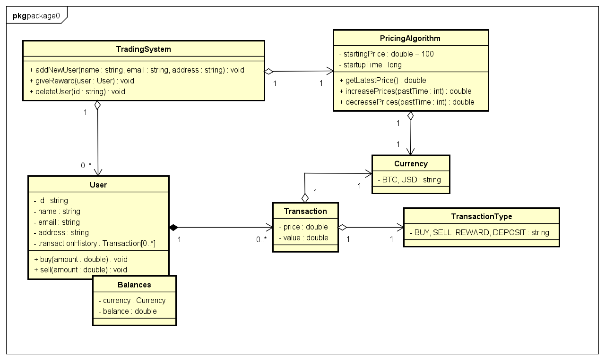

# TradingSystem

This system is trading simulation platform where users can trade BTC and view their transaction history.

This project uses Spring Boot with PostgresSQL and MongoDB.

If you want to learn more about SpringBoot, please visit its website: https://spring.io/projects/spring-boot .

## Packaging and running the application

The application can be packaged using:
```shell script
./mvnw package
```

## Running the application in different mode

In local mode:
```shell script
./mvnw compile spring-boot:run
```

In dev mode:
```shell script
./mvnw compile spring-boot:run -Dspring-boot.run.profiles=dev
```

In prod mode:
```shell script
./mvnw compile spring-boot:run -Dspring-boot.run.profiles=prod
```

## Running the application with docker

Build docker image:
```shell script
docker-compose build --no-cache
```

Start your docker container:
```shell script
docker-compose up -d
```

Rebuild docker image without downtime:
```shell script
docker-compose up -d --no-deps --build
```

Display system log in docker container:
```shell script
docker-compose logs -f --tail 100
```

Stop your docker container

```shell script
docker-compose down
```

## Displaying API ui in swagger

You can click swagger url when your application is running: http://localhost:8080/swagger-ui/index.html

## System designing diagram


## Table schema
User
key | Type
--- | ---
id | string
name | string
email | string
address | string
createdAt | date

Relationship
key | Type
--- | ---
id | string
userId | string
price | decimal
amount | decimal
currency | string
type | string
createdAt | date
